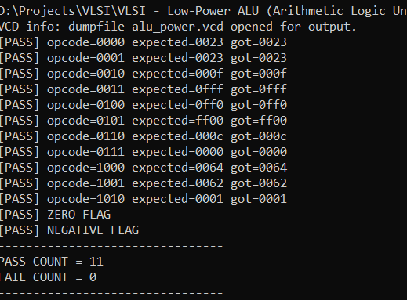
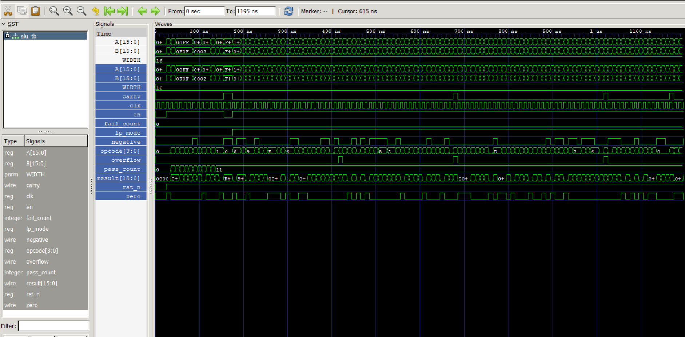

# Low-Power ALU (Arithmetic Logic Unit) Design using Verilog

## Overview

This project implements a parameterized Low-Power Arithmetic Logic Unit (ALU) using Verilog HDL. The design supports arithmetic, logical, shift, and comparison operations while incorporating low-power techniques such as operand isolation, RTL clock-enable, and low-power mode control.

The project was verified using Icarus Verilog and GTKWave through a self-checking testbench and waveform analysis.

---

## Project Objective

The objective of this project is to design and verify a synthesizable low-power ALU capable of performing multiple arithmetic and logical operations while reducing unnecessary switching activity through low-power RTL techniques.

---

## Features

### Arithmetic Operations

* Addition (ADD)
* Subtraction (SUB)
* Increment
* Decrement

### Logical Operations

* AND
* OR
* XOR
* NOT

### Shift Operations

* Shift Left
* Shift Right

### Comparison Operation

* Compare A and B

### Flag Generation

* Zero Flag
* Carry Flag
* Overflow Flag
* Negative Flag

### Low-Power Features

* Operand Isolation
* RTL Clock Enable
* Low-Power Shift Masking
* Approximate LSB Support (Adder)

---

## Architecture

Input Operands (A, B)
↓
Opcode Decoder
↓
ALU Functional Units
↓
Low-Power Control Logic
↓
Result Generation
↓
Flag Generation
↓
Output Register

---

## Opcode Table

| Opcode | Operation   |
| ------ | ----------- |
| 0000   | ADD         |
| 0001   | SUB         |
| 0010   | AND         |
| 0011   | OR          |
| 0100   | XOR         |
| 0101   | NOT         |
| 0110   | Shift Left  |
| 0111   | Shift Right |
| 1000   | Increment   |
| 1001   | Decrement   |
| 1010   | Compare     |

---

## Low-Power Design Techniques

### Operand Isolation

When a functional block is not required, its inputs are forced to zero. This reduces switching activity and dynamic power consumption.

### RTL Clock Enable

Registers update only when the enable signal is active. This concept allows synthesis tools to infer clock gating structures.

### Low-Power Mode

The ALU includes a low-power mode that reduces shifter activity and supports approximate arithmetic in selected configurations.

---

## Folder Structure

Low-Power-ALU-Verilog/

├── rtl/

│ ├── low_power_alu.v

│ └── lp_adder.v

├── tb/

│ └── alu_tb.v

├── waveforms/

│ └── alu_power.vcd

├── images/

├── reports/

├── docs/

├── README.md

└── .gitignore

---

## Tools Used

* Verilog HDL
* Icarus Verilog
* GTKWave

---

## Simulation Flow

### Compile

iverilog -g2012 -Wall -o alu_sim rtl/low_power_alu.v rtl/lp_adder.v tb/alu_tb.v

### Run

vvp alu_sim

### Open Waveform

gtkwave alu_power.vcd

---

## Verification Results

PASS COUNT = 11

FAIL COUNT = 0

### Verified Operations

* ADD
* SUB
* AND
* OR
* XOR
* NOT
* Shift Left
* Shift Right
* Increment
* Decrement
* Compare

### Verified Flags

* Zero Flag
* Negative Flag
* Carry Flag
* Overflow Flag

### Verified Low-Power Features

* Operand Isolation
* RTL Clock Enable
* Low-Power Mode

---

## Waveform Verification

GTKWave was used to verify:

* Clock operation
* Input transitions
* Opcode execution
* Result generation
* Zero flag behavior
* Negative flag behavior
* Low-power mode operation

---
## Project Screenshots

### Simulation Results

### Waveform Verification

## Industry Applications

* CPUs
* Microcontrollers
* Embedded Systems
* IoT Devices
* DSP Processors
* Mobile Processors
* AI Accelerators

---

## Future Improvements

* Dynamic Frequency Scaling (DFS)
* Per-Unit Functional Enables
* Multi-Cycle Shift Engine
* CLA Tiling
* UPF-Based Power Intent
* FPGA Implementation
* Power Analysis using Yosys/OpenSTA

---

## Learning Outcomes

* Verilog RTL Design
* Low-Power VLSI Concepts
* Operand Isolation
* Clock Enable Design
* Functional Verification
* Testbench Development
* Waveform Analysis
* Digital Design Fundamentals

---

## Author

Jatin Gujarathi

B.Tech Mechanical Engineering

Aspiring VLSI / Data Analyst Engineer

GitHub: https://github.com/jatingujju
